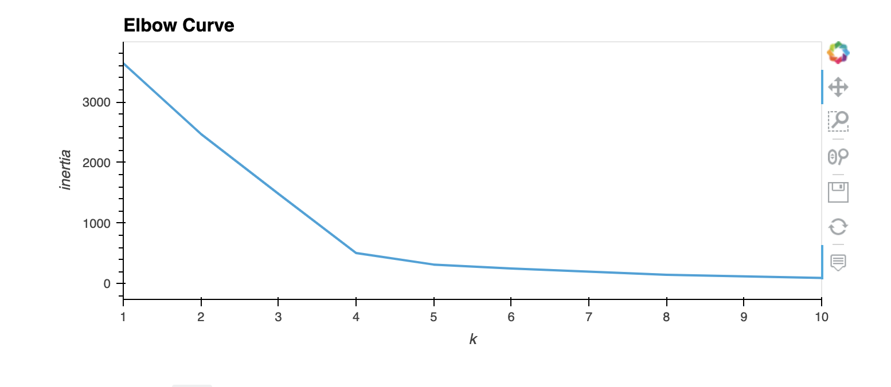
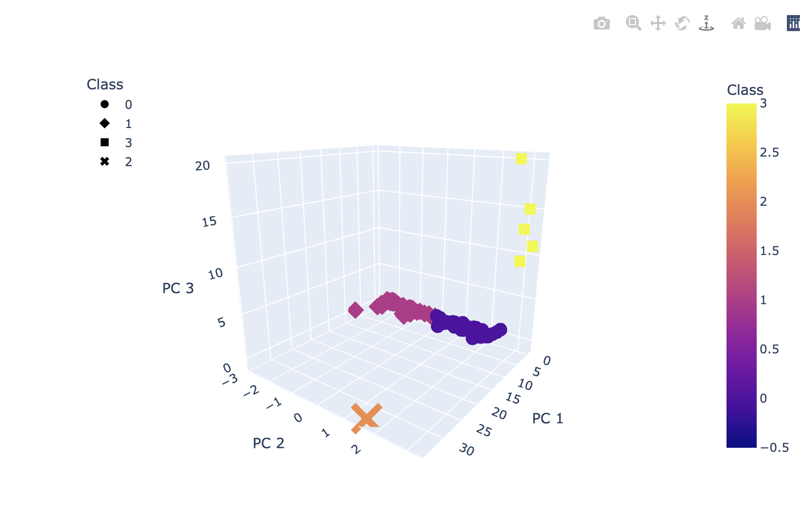

# Cryptocurrencies

## Overview of Analysis

For this analysis, I will use unsupervised learning (PCA) to process cryptocurrency data for a client. I need to create a report that includes what cryptocurrencies are on the trading market and group them to create a classification system. I will use a clustering algorithm to group the cryptocurrencies.

### Purpose

The purpose of this project is to use unsupervised machine learning to analyze cryptocurrency data and create a report of the traded cryptocurrencies classified by groups according to features.

## Results

## Summary

I classified 532 different cryptocurrencies based of similar features. I need to analyze each group individually to determine performance before presenting to clients.
